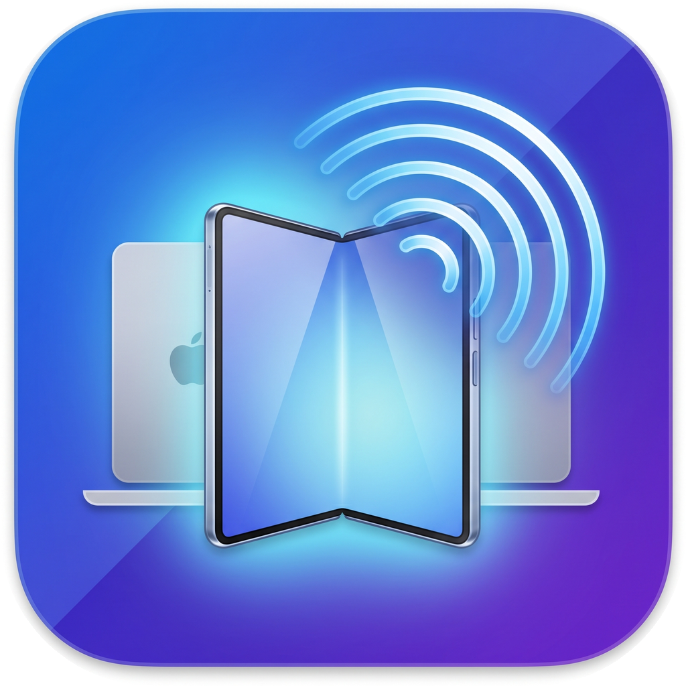

# FoldCast

Turn a **Galaxy Z Fold 7** (or any Android device) into a **real wireless
extended display** for a Mac — not screen mirroring, a genuine extra monitor
you can drag windows onto. USB-first (zero-latency via `adb`), Wi-Fi optional.



## Architecture (technical)

### 1. Component / data-flow diagram

```
              macOS  (FoldCast.app — Swift, single process)
 ┌───────────────────────────────────────────────────────────────────┐
 │                                                                   │
 │  CVirtualDisplay (ObjC shim)                                       │
 │     │  private CGVirtualDisplay / *Descriptor / *Settings / *Mode  │
 │     ▼                                                              │
 │  DisplayManager ──creates──►  ┌─────────────────────────────┐      │
 │     │  resize on viewport →   │  Virtual Display  (real      │      │
 │     │  recreate at WxH        │  CGDirectDisplayID, own      │      │
 │     │                         │  Space, windows dragged here)│      │
 │     │                         └──────────────┬──────────────┘      │
 │     ▼                                         │ frames              │
 │  Capture (ScreenCaptureKit SCStream)  ◄───────┘                     │
 │     │  CMSampleBuffer → CIImage → orient(rot/mirror)                │
 │     │  → JPEG (CIContext)                                           │
 │     ▼                                                               │
 │  State  ── latest JPEG + seq ──►  Server (Network.framework)        │
 │     ▲                                  │  GET /            (viewer) │
 │     │                                  │  GET /stream      (MJPEG)  │
 │  Input (CGEvent)  ◄── POST /input ──────┤  POST /input      (touch) │
 │     │  normalized → CGDisplayBounds     │  GET  /ctl        (rot/fit)│
 │     │  → mouse/scroll on the display    │  GET  /health              │
 │  NetService ── Bonjour _foldcast._tcp ──┘                           │
 └───────────────────────────────────────────────────────────────────┘
        ▲  HTTP (USB: adb reverse 8787 ┆ Wi‑Fi: LAN/Bonjour)  │
        │                                                     ▼
 ┌───────────────────────────────────────────────────────────────────┐
 │           Galaxy Z Fold 7  (FoldCast.apk — no Gradle)             │
 │                                                                   │
 │  MainActivity (immersive, no system bars, screen kept on)         │
 │     ├─ WebView ──   (MJPEG, object-fit:contain) │
 │     │     └─ JS: touch→/input (rAF-coalesced), viewport→/ctl?fit   │
 │     ├─ reachability probe loop (3 s, GET /health, off-UI thread)   │
 │     ├─ NsdManager  discover _foldcast._tcp  → IP-independent       │
 │     └─ waiting screen (spinner) until a server answers             │
 └───────────────────────────────────────────────────────────────────┘
```

### 2. Frame pipeline (Mac → phone)

```
 Virtual display ─► SCStream(.screen, BGRA, fps, pixel=WxH)
   └► CMSampleBuffer ─► CIImage(cvPixelBuffer)
        └► .oriented(rotation/mirror)  ← upright by default
             └► CIContext.jpegRepresentation(q≈0.55)
                  └► State.publish(jpeg, ++seq)
                       └► Server /stream: multipart/x-mixed-replace,
                          push newest only when seq changes
                            └► WebView  swaps frame
```
ScreenCaptureKit hands back **top-left-origin** buffers, so the image is
never upside-down; `--rotate`/Mirror only exist for odd phone stands.

### 3. Input path (phone → Mac)

```
 touchstart/move/end on 
   └► normalize to image content rect (handles letterbox)
        └► POST /input  k=tap|down|drag|up|rightclick|scroll  x,y∈[0,1]
             └► Input: invert rotation/mirror → CGDisplayBounds(id)
                  └► CGEvent(mouse*/scroll).post(.cghidEventTap)
```
Press-move-release maps to `leftMouseDown→Dragged→Up`, so you can **drag
real windows** onto the display; long-press → right click; 2-finger → scroll.

### 4. Auto-fit (no black bars, any orientation)

```
 phone rotates ─► JS reports innerW*dpr × innerH*dpr  (debounced 180 ms,
   re-fired 120/400/800 ms after orientationchange)
     └► GET /ctl?fitw=W&fith=H
          └► DisplayManager.fit(): if Δ>8px → stop capture,
             invalidate display, recreate at WxH, restart capture
               └► stream resumes at the new resolution → 1:1, no bars
```
Recreating a real monitor + restarting capture costs ~1–2 s; that delay is
inherent. Concurrent fit requests are coalesced (last size wins).

### 5. Connection resilience (state machine)

```
            ┌──────────────┐  /health OK (probe or page load)
            │   WAITING     │ ───────────────────────────────►┐
            │ spinner page  │                                 │
            │ probe q 3 s   │ ◄─── onReceivedError(http) ──────┤
            └──────┬───────┘                                  ▼
                   │ candidates, best-first:           ┌─────────────┐
                   │  1 Bonjour-discovered IP          │  CONNECTED  │
                   │  2 saved / explicit URL           │ live stream │
                   │  3 localhost:8787 (USB)           └─────────────┘
                   ▼
        every 12 s with no hit → NsdManager re-discovery
```
Consequences (all **verified on-device**):
- Mac app started **after** the phone app → phone auto-connects, no touch.
- **Cable unplugged** → falls back from localhost to Bonjour over Wi-Fi.
- **Mac IP changes** (DHCP) → Bonjour finds it by name, reconnects.
- "Stop Sharing" in the macOS menu → Mac side auto-resumes capture.
- The probe runs off the UI thread and **never blanks** the WebView, so the
  waiting screen stays visible (no black screen) until a server answers.

### 6. Startup sequence

```
 FoldCast.app: parse args → DisplayManager.bootstrap() (virtual display)
   → CGPreflightScreenCaptureAccess?  no → CGRequest…() ONCE (1 prompt)
   → poll a fresh `--check-access` helper proc (never prompts) until granted
   → SCStream start → "live"  → Server.start → adb reverse → NetService.publish
 Phone: MainActivity → showWaiting() → probe loop + NSD → first /health OK
   → WebView loads viewer → MJPEG + input + auto-fit running
```

### Design summary

- **Real extended display**, not mirroring: private `CGVirtualDisplay` ⇒
  macOS sees a physical monitor (own Space; drag windows in).
- **Stable self-signed code identity** ⇒ Screen Recording granted once, never
  re-prompts on rebuilds (ad-hoc signing changes the cdhash every build).
- **Pure SDK APK build** (aapt2/d8/apksigner, no Gradle/AGP; d8 needs JDK 17).
- **Self-healing**: order-independent, IP-independent, survives unplug and
  "Stop Sharing"; always shows a clear status, never a mystery black screen.

## Layout

| Path | What |
|------|------|
| `Sources/foldcast/` | macOS app (Swift): capture, MJPEG server, input, fit |
| `Sources/CVirtualDisplay/` | ObjC shim for the private CGVirtualDisplay API |
| `android/` | Fold app: immersive full-screen WebView (no Gradle) |
| `scripts/setup-signing.sh` | one-time: stable self-signed signing identity |
| `scripts/package.sh` | build → `FoldCast.app` (signed) |
| `android/build-apk.sh` | build/install `foldcast.apk` (raw SDK tools) |
| `assets/` | app icon (`.icns`, mipmaps, source) |

## First-time setup

```bash
# 1. Stable code-signing identity (so Screen Recording is granted ONCE
#    and never re-prompts on rebuilds). Fully non-interactive.
./scripts/setup-signing.sh

# 2. Build the macOS app
./scripts/package.sh

# 3. Build + install the Fold app (device connected via USB, adb on)
cd android && ./build-apk.sh --install && cd ..
```

## Run

```bash
open ./FoldCast.app --args --fps 30
```

- **First launch only**: macOS asks for Screen Recording once. Approve
  *FoldCast* in System Settings ▸ Privacy & Security ▸ Screen Recording.
  No relaunch needed — it detects the grant within ~2 s and starts. Thanks
  to the stable signature this is asked **exactly once, ever**.
- The Mac auto-runs `adb reverse tcp:8787 tcp:8787` if a device is attached.
- On the Fold, open the **FoldCast** app → it fills the whole screen with
  the Mac's extended desktop.

### USB (default) vs Wi-Fi

- **USB**: just works (the app defaults to `http://localhost:8787/` tunnelled
  over `adb reverse`). Lowest latency.
- **Wi-Fi — zero-config auto-discovery** (verified). The Mac advertises a
  Bonjour service `_foldcast._tcp`; the Fold app finds it via mDNS and
  connects **by name, not IP**. So:
  - **Unplug the cable** → it keeps working over Wi-Fi (data was already on
    Wi-Fi; even a localhost/USB default auto-falls-back to Bonjour).
  - **Mac IP changes** (DHCP, new network) → nothing to do; the app
    re-discovers the Mac at its new address automatically.
  - Manual override still available: 3-finger-tap → enter a URL, or
    `adb shell am start -n com.kentaro.foldcast/.MainActivity --es url http://<ip>:8787/`.
  Verified end-to-end: app data cleared (localhost default) + `adb reverse`
  removed → app auto-found the Mac over Wi-Fi and connected.
  (Android's bundled `/system/bin/curl` may time out against the server —
  irrelevant, the app uses the WebView HTTP stack.)

### Options

```
--width N --height N   initial display size (auto-fits to the phone after)
--fps N                target frame rate (default 30)
--quality 0..1         JPEG quality (default 0.55)
--rotate 0|90|180|270  fixed rotation; also live via on-screen buttons
--mirror               horizontal mirror
--hidpi 1              create a HiDPI/Retina virtual display
--port N               HTTP port (default 8787)
```

## Verified

Galaxy Z Fold 7 (SM-F966Q), macOS 26.5, Apple M4 Max. Real extended display
confirmed by dragging a TextEdit window onto it; upright; portrait **and**
landscape full-bleed (no black bars); touch drag/scroll/right-click working.

## Known limitations

- **`CGVirtualDisplay` is a private API.** Works on macOS 26.5 today; a future
  macOS could change/remove it. No public alternative exists for arbitrary
  virtual displays.
- **Screen Recording permission is mandatory** (macOS security). Granted once
  with the stable identity; if you ever rebuild with `--sign -` (ad-hoc)
  instead, macOS will re-prompt every time — keep using `setup-signing.sh`.
- **Rotation re-fit takes ~1–2 s.** Changing orientation tears down and
  recreates a real monitor and restarts screen capture; a brief frozen/!blank
  frame during that window is inherent, not a bug. Latency is already tuned
  (debounced 180 ms, staged re-fire, fast re-registration polling).
- **"Stop Sharing" auto-resumes by design.** Clicking *Stop Sharing* in the
  macOS Screen-Recording menu kills the capture; FoldCast detects this and
  restarts within ~1 s (an extended display that freezes is useless). To
  actually stop, **quit FoldCast** (Ctrl-C / kill the process). Before this
  fix, hitting Stop Sharing froze the phone on the last frame and looked hung.
- Recreating the display on resize can shuffle existing window positions
  (macOS moves windows off a disappearing monitor).
- **MJPEG**, not H.264 — simple and robust; bandwidth-heavier than a codec.
  Fine over USB and typical Wi-Fi at 1968×2184@30.
- The Fold app is a thin immersive WebView (no Gradle/AndroidX); rendering
  uses the system WebView. No audio routing.
- TCC reset note: `tccutil reset ScreenCapture` (no bundle id) clears Screen
  Recording for *all* apps — use `tccutil reset ScreenCapture com.kentaro.foldcast`
  to scope it to FoldCast only.

## Stop

`Ctrl-C` the process (or quit FoldCast) — the virtual display disappears
and macOS restores the previous arrangement.
